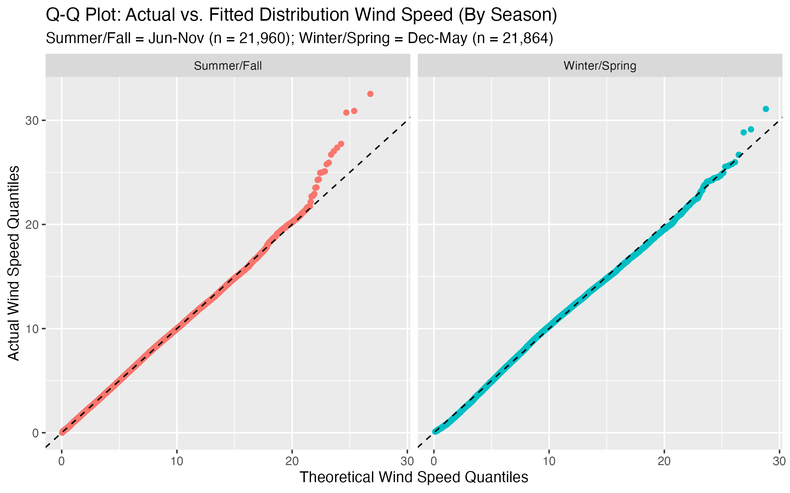
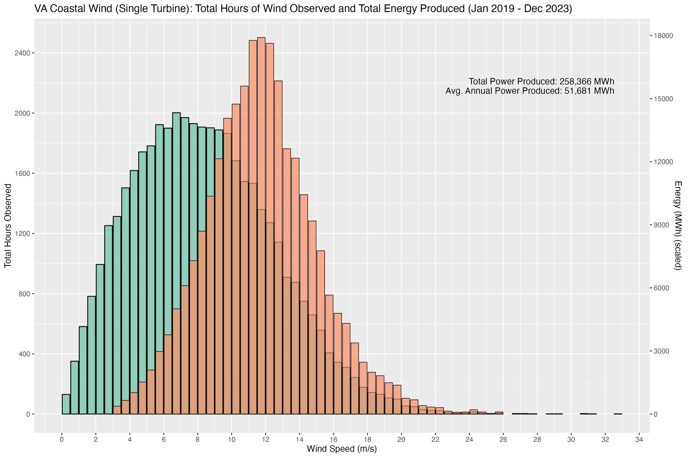

# VA_Coastal_Wind

This is some analysis of the upcoming Coastal Virginia Offshore Wind project by Dominion Energy. Dominion is building a commercial wind farm about 27 miles off the coast of Norfolk, VA which is expected to produce about 9.5 million MW of power per year.

The project began with a pilot project, finished in 2020, consisting of 2 12MW turbines. The commercial project, which is expected to be finished in 2026, will be much larger-- with 176 14MW turbines planned.

The model uses 5 years of aggregated hourly weather data, and the expected wind turbine performance parameters to model expected power output and capacity factor.

Dominion CVOW Website: <https://coastalvawind.com>

Special thanks to Open Meteo for the weather API: <https://open-meteo.com>

# Analysis Summary

The analysis used climatology data over the period of January 1st, 2019 until December 31st 2023 from Open Meteo to get hourly wind speed and calculate air density from temperature, relative humidity, and pressure:

Wind speeds typically follow a Weibull distribution, which is strictly greater than zero and can have a longer right tail depending on the location.  Taking all 43,824 hourly wind observations, you can see the histogram of wind speed plotted over the fitted Weibull distribution. This distribution has a mode of about 7 m/s.

However, there seems to be a lot of seasonal differences in mean wind speed and minor differences in the day vs. night:

I found that the most dramatic difference was in wind speeds during the summer and fall vs. winter and spring, as you can see from the previous histogram.  Below I've made the same histogram, with fitted distributions, plotted by season. In this graph, a peak higher and to the left means that there are more occurences and tighter groupings of lower wind speeds.  The peak lower and to the right means than wind speeds tend to be more broadly distributed, but higher.

You can visualize the goodness-of-fit of the fitted weibull distribution using a Q-Q Plot. This depicts the actual quantiles of data on the y-axis, and predicted quantiles on the x-axis. A perfectly fitted distribution would fall exactly on the dotted line.  As you can see, both distributions are fitted fairly well, although in the Summer and Fall there tends to be more observations than expected in the highest quantiles.  This indicates that the actual right tail is fatter than would be expected, and there may be some occasions of higher wind speeds than predicted.

Just for fun, I also made a GIF of the fitted wind speed distributions by month.

# Power Modeling

I used available open source data about the Siemens-Gamesa 14-222 DD turbine, which is most likely the one to be used in the project. This is a 14MW rated capacity turbine with a blade diameter of 222 meters.

I was able to find information about cut-in speed, rated speed, and cut-out speed from en.wind-turbine-models.com.  This predicted power output is shown on the expected turbine power curve below using actual wind and air density data from the VA Coastal Offshore Wind project location.

Wind turbine power increases linearly with air density, and increases by wind speed to the third power.  As such, wind speed is by far the most important predictor of turbine power output, and you will tend to generate the bulk of the years power at less-frequent higher wind speeds.

This phenomenon is shown below, in the weighted average power histogram plotted over expected wind speeds.  The mode for wind speed remains unchanged at around 7 m/s, but the bulk of the power produced is shifted to the right with most of the power produced grouped around wind speeds of 12 m/s.

Finally, I calculated expected capacity factor.  The capacity factor expressed as a percentage, and represents what percentage of rated power is produced over some time period.  In this case rated power is 14MW, so if we only produced 7MW on average over the year 2022 then we would have a 0.50 capacity factor for the year.

Because the wind speed was so heavily dependent on seasonal climate changes, I calculated this capacity factor on a monthly basis aggregated over 5 years.  This plot is shown below.

This capacity factor is highly dependent on seasonal changes, which will impact the energy available to the grid in VA.  The median capacity for the year around 0.30 and is shown by the dotted line.  As you can see, the winter and spring months tend to be more productive, with a peak capacity of around 0.60 in March which dips severely to around 0.10 in August.

