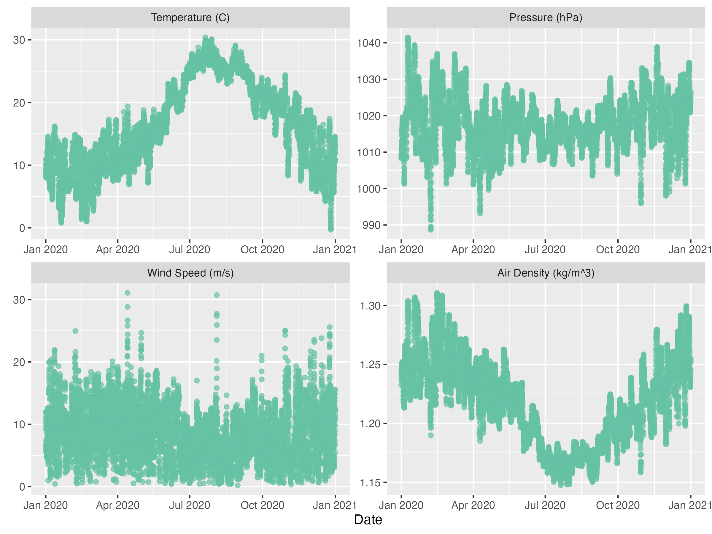
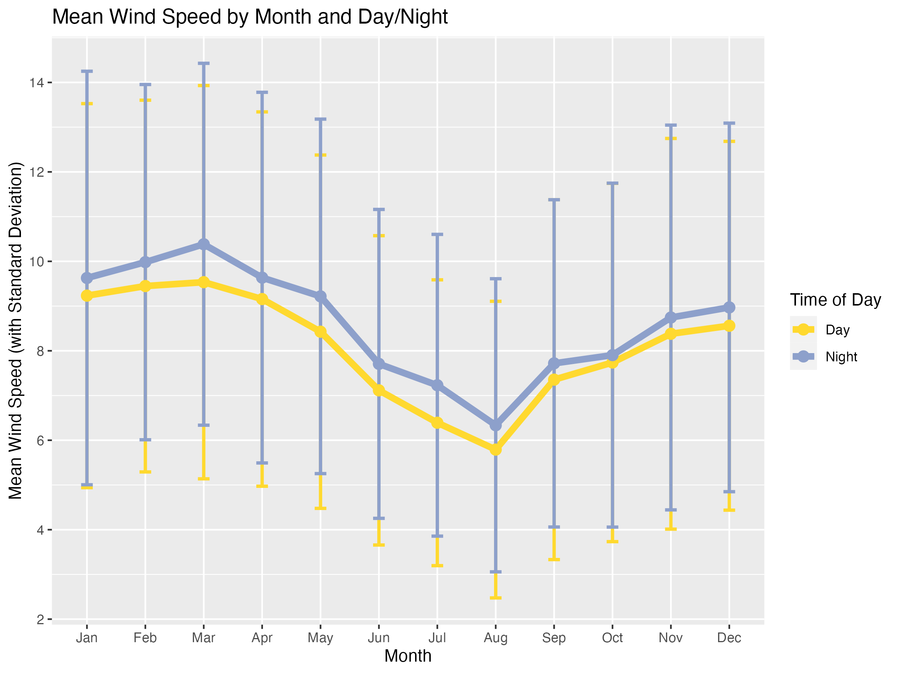

# VA_Coastal_Wind

This is some analysis of the upcoming Coastal Virginia Offshore Wind project by Dominion Energy. Dominion is building a commercial wind farm about 27 miles off the coast of Norfolk, VA which is expected to produce about 9.5 million MW of power per year.

The project began with a pilot project, finished in 2020, consisting of 2 12MW turbines. The commercial project, which is expected to be finished in 2026, will be much larger-- with 176 14MW turbines planned.

The model uses weather data from the past 5 years, and the expected wind turbine performance parameters to model expected power output and capacity factor.

Dominion CVOW Website: <https://coastalvawind.com>

Special thanks to Open Meteo for the weather API: <https://open-meteo.com>

# Analysis Summary

The analysis looks at big picture weather trends in the region and the effect on power output:

And does some deeper analysis into wind trends vs. time of year:

Then plots the expected single-turbine power curve:

Additionally, I found the expected distribution of wind speeds and the effect on power output based on the turbine power curve:

