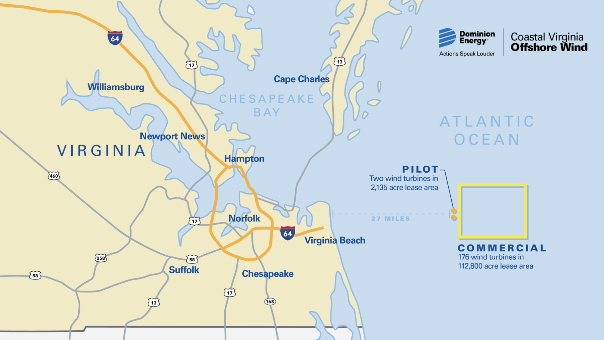
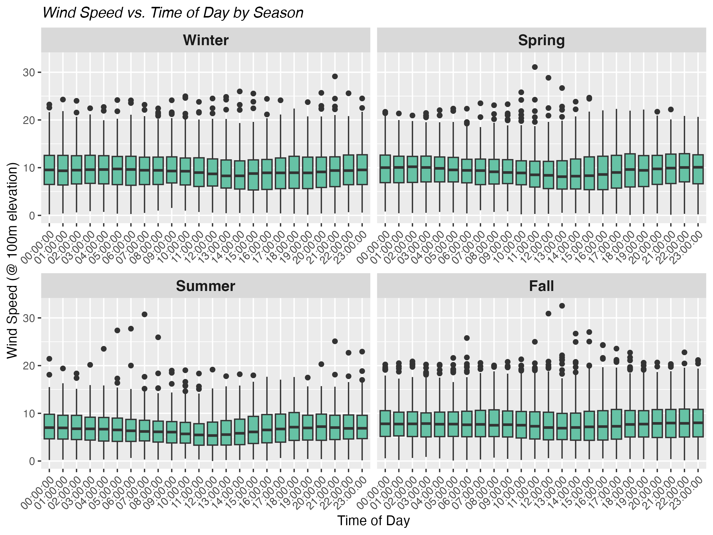
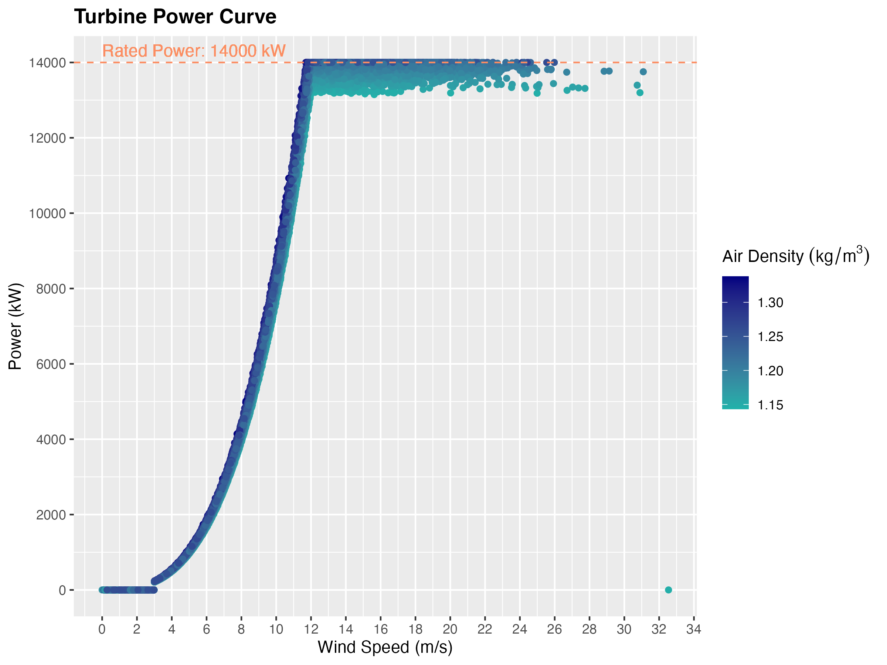

# Introduction

The Coastal Virginia Offshore Wind Project is an offshore wind turbine installation being developed by Dominion Energy in conjunction with Siemens-Gamesa.

```{r, echo=FALSE, message=FALSE}

```

# Data Overview

Put an overview of data sources and all that good stuff.

Here's an example of a plot that shows how wind in this area varies by time of day and by season:

```{r, echo=FALSE, message=FALSE}

```

Here's the plotted turbine power curve:

```{r, echo=FALSE, message=FALSE}

```

Here's the weighted average power plot:

```{r, echo=FALSE, message=FALSE}
knitr::include_graphics("images/weighted_average_power_and_wind.png")
```
