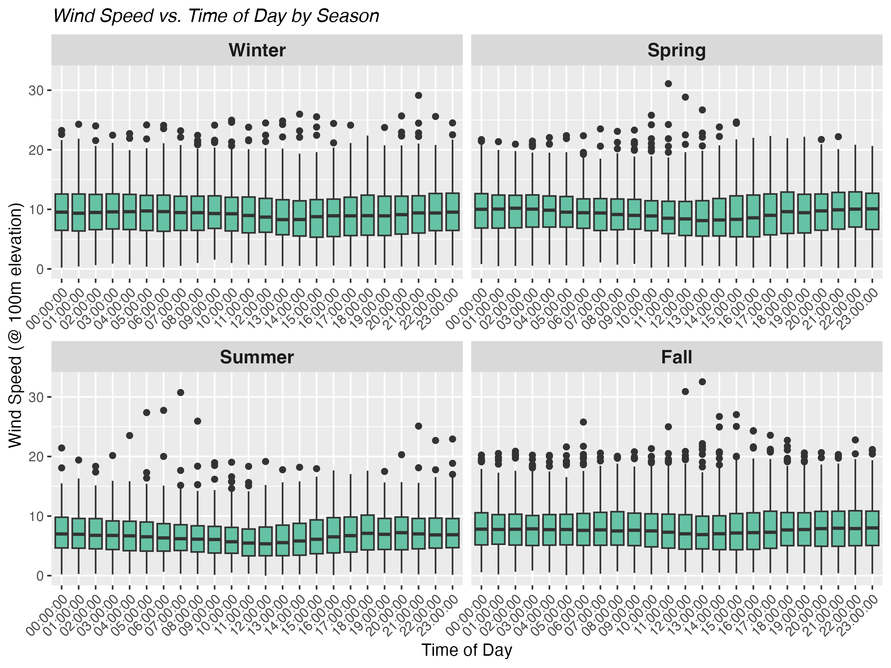

# Introduction

The Coastal Virginia Offshore Wind Project is an offshore wind turbine installation being developed by Dominion Energy in conjunction with Siemens-Gamesa.

<!-- -->

# Data Overview

Put an overview of data sources and all that good stuff.

Here's an example of a plot that shows how wind in this area varies by time of day and by season:

<!-- -->

Here's the plotted turbine power curve:

<!-- -->

Here's the weighted average power plot:

<!-- -->
